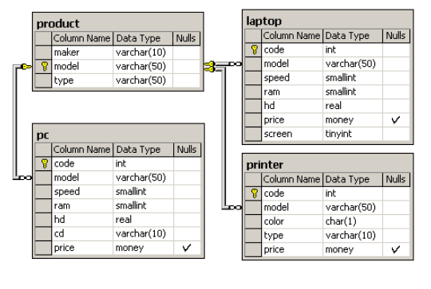

# Web Engineering

## homework_08

Схема базы данных состоит из четырех таблиц:

- Product (производитель, модель, тип)
- PC (код, модель, скорость, ОЗУ, жесткий диск, CD, цена)
- Laptop (код, модель, скорость, ОЗУ, жесткий диск, экран, цена)
- Printer (код, модель, цвет, тип, цена)

Таблица Product содержит данные о производителе, номере модели и типе продукта ('PC', 'Laptop' или 'Printer'). Предполагается, что номера моделей в таблице Product уникальны для всех производителей и типов продуктов. Каждый персональный компьютер в таблице PC однозначно идентифицируется уникальным кодом и дополнительно характеризуется своей моделью (внешний ключ, ссылающийся на таблицу Product), скоростью процессора (в МГц) — поле speed, объемом оперативной памяти (в Мб) — поле ram, объемом жесткого диска (в Гб) — поле hd, скоростью CD-ROM (например, '4x') — поле cd и его ценой. Таблица Laptop аналогична таблице PC, за исключением того, что вместо скорости CD-ROM она содержит размер экрана (в дюймах) — поле screen. Для каждого принтера в таблице Printer указывается его тип вывода ('y' для цветного и 'n' для монохромного) — поле color, технология печати ('Laser', 'Jet' или 'Matrix') — поле type, а также цена.

1. Найдите все записи таблицы Printer для цветных принтеров.

2. Найдите номера моделей и цены всех имеющихся в продаже продуктов (любого типа) производителя B (латинская буква).

3. Найдите производителя, выпускающего ПК, но не ПК-блокноты.

4. Найдите производителей ПК с процессором не менее 450 Мгц. Вывести: Maker

5. Найдите среднюю скорость ПК.

6. Для каждого производителя, имеющего модели в таблице Laptop, найдите средний размер экрана выпускаемых им ПК-блокнотов. Вывести: maker, средний размер экрана.

